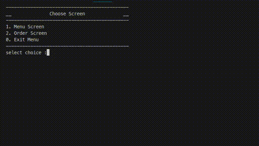
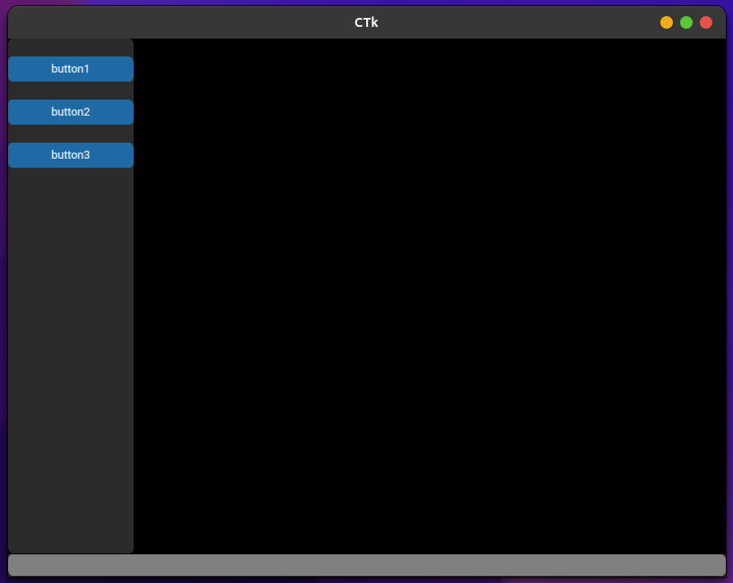

# hotelOperationPy

### create virtual environment
- Use `Ctrl+p` and type `>Python: Select Interpreter` and select from list `pyenv`
- To save dependencies used in project `pip3 freeze > requirements.txt`

### Install dependent packages
- To install dependencies for project `pip3 --disable-pip-version-check --no-cache-dir install -r requirements.txt` or `pip install -r requirements.txt`

### hotel console

### hotel CTk

